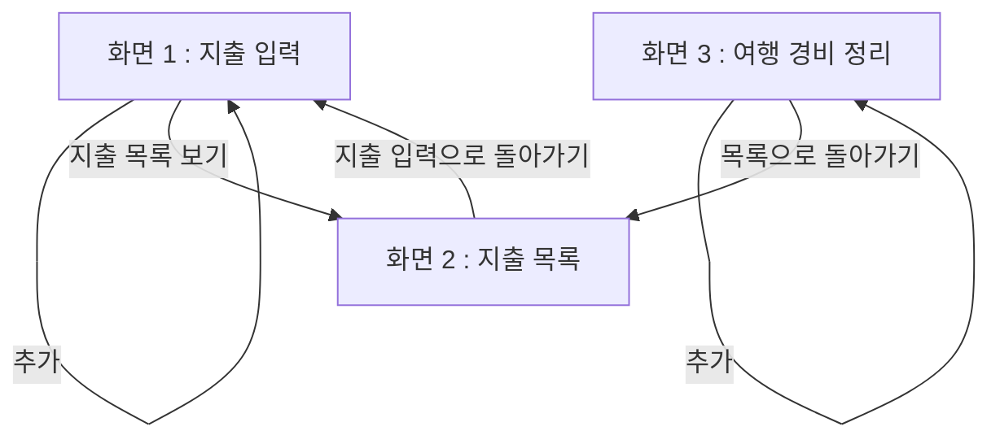

# 화면 흐름도

```mermaid
flowchart TD
    A["화면 1 : 지출 입력"]
    B["화면 2 : 지출 목록"]
    C["화면 3 : 여행 경비 정리"]

    A -->|추가| A
    A -->|지출 목록 보기| B
    B -->|지출 입력으로 돌아가기| A
    C -->|추가| C
    C -->|목록으로 돌아가기| B
```
